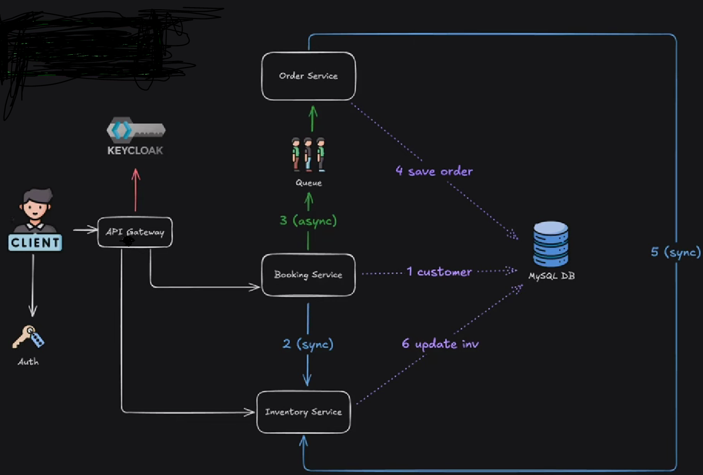

This project is a **backend system for a ticket buying platform**, built using **Spring Boot microservices**.  
It demonstrates a modern architecture with **authentication, inter-service communication, asynchronous messaging, resilience patterns, and persistent storage**.

## Architecture




### Flow
1. **Client** authenticates via **Keycloak (OAuth2)** through the API Gateway.  
2. **Booking Service** validates the customer (sync with MySQL).  
3. **Booking Service → Order Service** communication happens asynchronously via **Kafka**.  
4. **Order Service** saves the order in **MySQL**.  
5. **Inventory Service** fetches event details from **MySQL** (sync).  
6. **Inventory Service** updates inventory (sync).  

##  Tech Stack

- **Spring Boot (Microservices Architecture)**
- **Spring Security + Keycloak** → OAuth2 authentication & authorization
- **Spring Data JPA** → ORM with MySQL
- **Apache Kafka** → asynchronous messaging between services
- **Resilience4j (Circuit Breaker)** → fault tolerance
- **Spring Cloud Gateway** → API gateway
- **MySQL** → relational database
- **Docker Compose** → containerized deployment (DB, Keycloak, Kafka, services)

```
# Start MySQL, Keycloak, Kafka, and Zookeeper
# this is inside inventoryservice
docker-compose up -d

# run each service simultanously
```